import { Card, LinkButton } from "@astrojs/starlight/components";

A Bight app is organized into four layers. Understanding these layers makes the rest of the framework predictable, since every file in your project belongs to exactly one of them.



## The Layers

<Card title="Entry Seam" icon="seti:tsconfig">
  The framework's boot configuration. It creates the Discord client, sets
  gateway intents, runs filesystem discovery, and wires plugins into the
  runtime. You configure it once and rarely touch it again.
</Card>

<Card title="Services" icon="setting">
  Your app-owned integrations. Every external dependency (database clients,
  cache layers, error reporters, localization, etc) is explicitly defined here
  and passed to your commands through the `context` object.
</Card>

<Card title="Plugins" icon="puzzle">
  Lifecycle hooks that run around your application without being called directly. A plugin might register a global precondition, start a scheduled task on boot, or subscribe to diagnostic events.

<LinkButton
  href="/architecture/plugins/"
  variant="minimal"
  icon="external"
  iconPlacement="end"
  style={{ marginBottom: "-1rem" }}
>
  Learn more: Services vs Plugins
</LinkButton>
</Card>

<Card title="Feature Code" icon="star">
  The user-facing logic: slash commands, button handlers, modal submissions.
  This is where your bot's actual value lives.
</Card>

## The context object

Instead of importing global singletons, Bight passes a `context` object into every handler. Through `context`, you access your services, the Discord client, and the logger:

```ts title="src/commands/profile.ts"
import { defineCommand } from "@bight-ts/core";
import { SlashCommandBuilder } from "discord.js";

export default defineCommand({
  data: new SlashCommandBuilder()
    .setName("profile")
    .setDescription("View your profile."),

  async execute({ interaction, context }) {
    const user = await context.services.db.user.findUnique({
      where: { discordId: interaction.user.id },
    });

    await interaction.reply(
      user ? `Level: ${user.level}` : "No profile found.",
    );
  },
});
```

This keeps feature code predictable, typesafe and testable. To test a command, pass a mock `context` with mock services.
