import { FileTree, Icon } from "@astrojs/starlight/components";

`pnpm create bight` generates an opinionated `src/` layout. The directory names stay consistent as the app grows, so learning them once pays off across the entire documentation.

## Directory layout

{/* prettier-ignore */}
<FileTree>
  - src/ 
    - `bight.ts` Framework entry 
    - commands/ Slash command definitions 
    - config/ Static configuration 
    - events/ Discord client event listeners 
    - features/ Feature modules 
    - interactions/ Button, modal, and select menu handlers 
    - plugins/ Lifecycle hooks 
    - preconditions/ Reusable access-control rules 
    - services/ App-owned integrations 
    - storage/ Storage adapter configuration
</FileTree>

Depending on CLI selections, you may also see `i18n/`, `message-commands/`, `prefix-commands/`, or `db/`.

## What belongs where

#### <Icon name="forward-slash" /> Commands and interactions

The surfaces users touch. `commands/` holds slash command definitions; `interactions/` holds component handlers (buttons, modals, selects). For logic shared across multiple commands, extract it into `services/` or `features/`.

#### <Icon name="setting" /> Services

Your app's external integrations: database clients, cache layers, error reporters, localization. Services are explicitly defined and passed through the context object. See [Services](/architecture/services/).

#### <Icon name="puzzle" /> Plugins

Code that hooks into the app lifecycle without being called directly. Startup checks, persistent schedulers, devtools, and global preconditions live here. See [Plugins](/architecture/plugins/).

#### <Icon name="rocket" /> Features

When a flat `commands/` + `interactions/` layout stops scaling, group related logic by domain using [Feature Modules](/architecture/feature-modules/).

#### <Icon name="seti:db" /> Storage

The adapter configuration for Bight's internal key-value store (framework settings, plugin state). Not a replacement for your application database. See [Settings & Data Strategy](/storage-and-data/settings-and-data/).

### The entry file: `src/bight.ts`

This file is the single point where client options, gateway intents, filesystem discovery, plugins, and runtime policies come together. You'll rarely need to modify it beyond the initial setup, but understanding its shape is important. It defines the boundary between your code and the framework.

